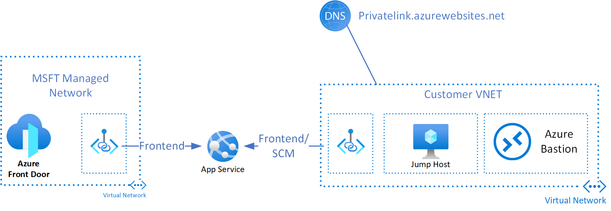
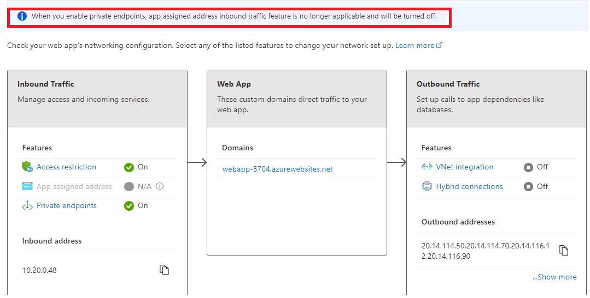
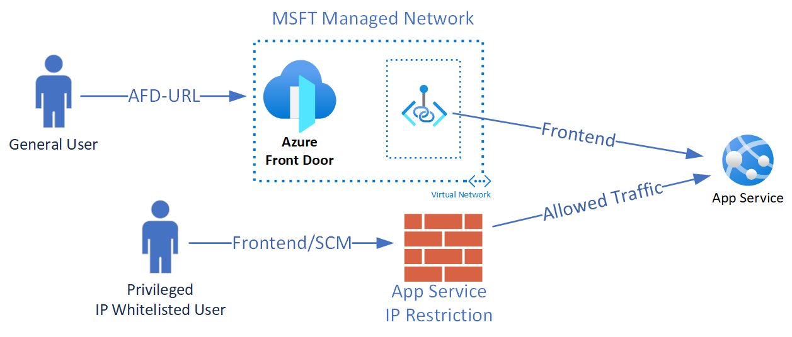

# Azure Frontdoor Samples
The following repository contains sample Azure Front Door (AFD) configurations implemented with Terraform. 

# Azure frontdoor with App service
Azure frontdoor can be leveraged to frontend, protect and distribute traffic globally for app service instances. There are 2-3 deployment models for this.

## AFD with app service and private endpoint
A single region deployment with AFD and app service with private endpoint looks like the following diagram: 

- AFD support privatelink, where one of the private endpoints to the app service will be within a MSFT managed network that AFD will access and push traffic through. 
- This model ensures a 1-1 relationship between the private endpoint, AFD and app service such that direct public access for the app service is via AFD only and no access via public endpoint (ex. myappservice.azurewebsites.net)
- Customer pushing code to or accessing the app service kudu site would need to do this via a separate private endpoint within the customer VNET in this model. 
- Note that app assigned address inbound and Private Endpoint can not both be enabled for App Service as shown here:


## AFD with app service private endpoint and public endpoint
An alternative to private endpoint ingress only example is the private endpoint and public endpoint dual ingress model depicted below:
 

The key difference vs. the private endpoint only model is SCM is accessible via app service public endpoint and restricted with access restriction. To enable this scenario, you would deploy the private endpoint only sample without the customer VNET/resources and enable public access to the app service. By default, when you enable Private Endpoints to your Web App, Azure disables all public access to the web app. You can re-enable this with the following command: 

```
az rest --method patch --url <your app service resource id>?api-version=2020-06-01 --body "{'properties': {'publicNetworkAccess': 'Enabled'}}"
```